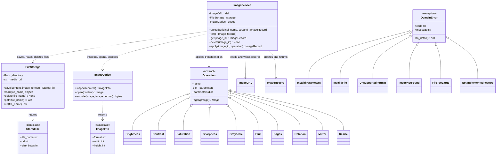

```mermaid
classDiagram
    direction TB

    class ImageService {
        -ImageDAL _dal
        -FileStorage _storage
        -ImageCodec _codec
        +upload(original_name, stream) ImageRecord
        +list() ImageRecord[]
        +get(image_id) ImageRecord
        +delete(image_id) None
        +apply(image_id, operation) ImageRecord
    }

    class Operation {
        <<abstract>>
        +name
        -dict _parameters
        +parameters dict
        +apply(image)* Image
    }

    class Brightness
    class Contrast
    class Saturation
    class Sharpness
    class Grayscale
    class Blur
    class Edges
    class Rotation
    class Mirror
    class Resize

    Operation <|-- Brightness
    Operation <|-- Contrast
    Operation <|-- Saturation
    Operation <|-- Sharpness
    Operation <|-- Grayscale
    Operation <|-- Blur
    Operation <|-- Edges
    Operation <|-- Rotation
    Operation <|-- Mirror
    Operation <|-- Resize

    class ImageCodec {
        +inspect(content) ImageInfo
        +open(content) Image
        +encode(image, image_format) bytes
    }

    class ImageInfo {
        <<dataclass>>
        +format str
        +width int
        +height int
    }

    class FileStorage {
        -Path _directory
        -str _media_url
        +save(content, image_format) StoredFile
        +read(file_name) bytes
        +delete(file_name) None
        +path(file_name) Path
        +url(file_name) str
    }

    class StoredFile {
        <<dataclass>>
        +file_name str
        +url str
        +size_bytes int
    }

    class ImageDAL
    class ImageRecord

    class DomainError {
        <<exception>>
        +code str
        +message str
        +to_detail() dict
    }

    class InvalidParameters
    class InvalidFile
    class UnsupportedFormat
    class ImageNotFound
    class FileTooLarge
    class NotImplementedFeature

    ImageService ..> ImageDAL : reads and writes records
    ImageService ..> ImageRecord : creates and returns
    ImageService ..> FileStorage : saves, reads, deletes files
    ImageService ..> ImageCodec : inspects, opens, encodes
    ImageService ..> Operation : applies transformation

    ImageCodec ..> ImageInfo : returns
    FileStorage ..> StoredFile : returns

    DomainError <|-- InvalidParameters
    DomainError <|-- InvalidFile
    DomainError <|-- UnsupportedFormat
    DomainError <|-- ImageNotFound
    DomainError <|-- FileTooLarge
    DomainError <|-- NotImplementedFeature
```