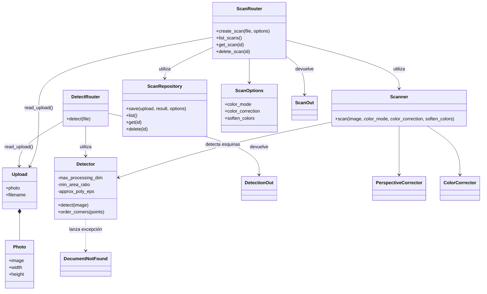

```mermaid
classDiagram

class DetectRouter {
    +detect(file)
}

class ScanRouter {
    +create_scan(file, options)
    +list_scans()
    +get_scan(id)
    +delete_scan(id)
}

class Detector {
    -max_processing_dim
    -min_area_ratio
    -approx_poly_eps
    +detect(image)
    +order_corners(points)
}

class Scanner {
    +scan(image, color_mode, color_correction, soften_colors)
}

class ScanRepository {
    +save(upload, result, options)
    +list()
    +get(id)
    +delete(id)
}

class Upload {
    +photo
    +filename
}

class Photo {
    +image
    +width
    +height
}

class ScanOptions {
    +color_mode
    +color_correction
    +soften_colors
}

class ScanOut

class DetectionOut

class DocumentNotFound

class PerspectiveCorrector
class ColorCorrector

DetectRouter --> Detector : utiliza
DetectRouter --> Upload : read_upload()
DetectRouter --> DetectionOut : devuelve

ScanRouter --> Scanner : utiliza
ScanRouter --> ScanRepository : utiliza
ScanRouter --> Upload : read_upload()
ScanRouter --> ScanOptions
ScanRouter --> ScanOut : devuelve

Upload *-- Photo

Scanner --> Detector : detecta esquinas
Scanner --> PerspectiveCorrector
Scanner --> ColorCorrector

Detector ..> DocumentNotFound : lanza excepción
```